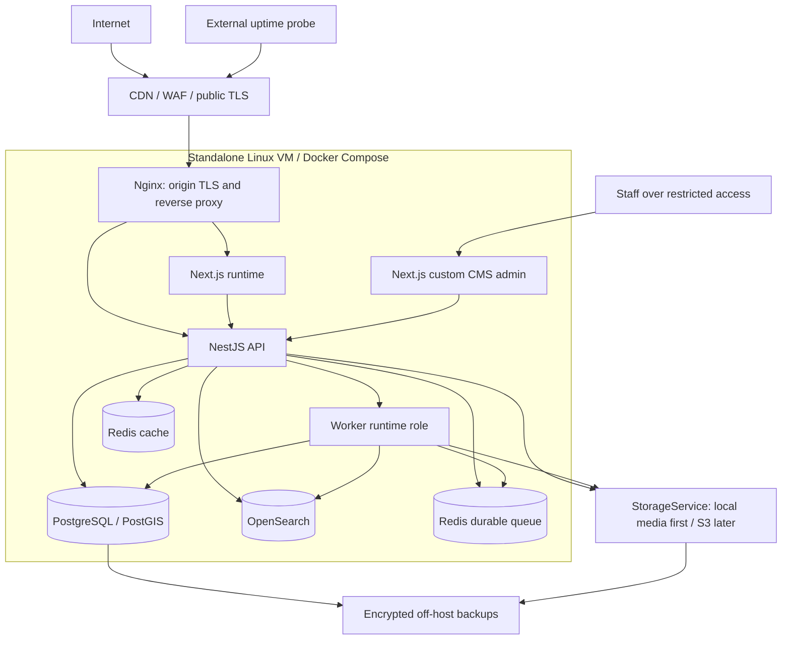

# Deployment and operational architecture

Date: 2026-10-02. Status: recommended; no infrastructure provisioned.

See [system architecture](system-architecture.md), [ADR-0009](../adr/0009-deployment-and-recovery.md) and the [existing standalone-server plan](../08-infrastructure/infrastructure.md). Next.js is confirmed; PostgreSQL/PostGIS is initial canonical SQL storage and local-first media remains behind StorageService. The older infrastructure document is reconciled. Operational defaults are in [implementation defaults](implementation-defaults.md).

## Launch topology

One Hetzner Ubuntu LTS VM runs Docker Compose. Nginx terminates origin TLS and routes public HTML/assets to Next.js and `/api/v1` to NestJS. CDN/WAF fronts the origin; restrict origin ingress to approved edge addresses or authenticated origin connections. CMS administration is reachable through VPN/allowlist and strong staff authentication, not ordinary public routing. Use a cloud VM provider only after region, cost, backup and privacy decisions; no provider is assumed.

CMS is presentation over NestJS Content commands and has no direct database credentials; ADR-0012 supersedes the separate Strapi database. API-to-worker arrow represents job coordination via queue/outbox, not a synchronous network API. CMS, worker and API reach provider ports only as required. Telemetry should be collected outside the critical host where affordable.

## Processes and resource policy

| Role | Exposure | Persistence / policy |
| --- | --- | --- |
| Nginx | Only public origin 80/443; 80 redirects to TLS | Config/certificates backed up; trusted proxy/body/timeout limits |
| Web | Private to proxy | Immutable build; explicit persistent/rebuildable render cache; no PII cached |
| API | Private to proxy/web | Stateless business process apart from DB-backed sessions; bounded DB pool |
| Worker | No public listener | Same backend image, separate command; bounded processing concurrency and graceful draining |
| Custom CMS | Internal plus restricted staff route | Next.js shell; future API-authenticated editorial operations |
| PostgreSQL/PostGIS | Private backend network, no public port | Named persistent volume; app/CMS roles; backups/WAL |
| OpenSearch | Private backend network, no public port | Persistent derived index; explicit heap/disk watermark budget |
| Redis cache | Private backend network | Eviction permitted; never authoritative |
| Redis queue | Private backend network | Separate no-eviction process, persistence, delivery dedupe; outbox is recovery source |
| Local media initially | Only approved public derivatives through proxy | Public/private/quarantine volumes separated; off-host encrypted backup |

Use distinct proxy/app/data access networks where practical. Do not publish internal container ports on `0.0.0.0`. SSH is key-only over VPN/allowlist. Containers use non-root users where compatible, drop capabilities, bounded memory/CPU/pids, restricted writable mounts and no application access to the Docker socket. Configure health checks, restart policy and graceful stop windows; restart is not a cure for corrupt persistent data.

The existing 8–16 vCPU / 32–64 GB RAM / NVMe capacity class is unvalidated. Budget OpenSearch heap, PostgreSQL buffers/pools, SSR, custom CMS and image jobs together; preserve host headroom. Load-test realistic documents, geo filters, cache misses and concurrent media work before purchase/final sizing. Separate heavy jobs or search infrastructure when resource contention is observed. A single host is a single failure domain and provides no high-availability guarantee.

## Environments and configuration

Local development uses Compose with disposable fixtures and the local media provider. Staging uses production-equivalent service versions/config patterns, independent DBs/buckets/keys and authenticated access. Production has isolated credentials, storage prefixes/buckets and backup destination. Never copy live traveler contacts or verification evidence into development; generate sanitized fixtures. `robots.txt` noindex is secondary to staging authentication.

Pin compatible supported runtime/database/CMS versions and container image digests during foundation implementation. Validate required environment variables at startup. Inject secrets via protected mounts or a selected secret manager; do not bake them into images or Next.js public bundles. Separate migration, app, CMS and backup credentials. Record rotations without secret values. Document DNS, TLS renewal, edge trust and storage ownership.

## CI/CD and release sequence

1. Locked dependency install, strict lint/typecheck, unit tests and architecture import checks.
2. Real-dependency integration tests using PostgreSQL/PostGIS, Redis, OpenSearch and storage fixtures where relevant; test migrations from prior release and clean install. API compatibility and initial-HTML checks.
3. Production builds, immutable versioned images/digests, dependency/image scans and provenance. Build once and promote the same artifacts.
4. Deploy staging; run health/readiness, publication/withdrawal, authorization and representative mobile smoke tests. Exercise compatible rollback before production.
5. Production approval per the existing infrastructure policy; verify backup success, capacity, migration plan and prior image availability. This is a future release control, not an approval needed to write these docs.
6. Acquire a migration lock and run backward-compatible expand migrations once with migration credentials. Keep old application compatible; destructive changes do not run during startup. Backfill asynchronously with progress/checkpoints before contract migrations in a later release.
7. Replace containers in a documented order, health check, warm only approved public pages and check queue/index lag. Initial Compose rollout may have a short maintenance window; do not promise zero downtime. Decide blue/green only if availability needs justify extra capacity.
8. On application failure, revert image/config to the previous compatible release. Do not automatically down-migrate or restore the DB over new committed writes. Database restore is disaster recovery with an explicit incident plan, not normal deployment rollback.

Keep release manifests, migration versions and operational logs. Production smoke tests use synthetic non-sensitive fixtures and must not accidentally contact real travelers or partners.

## Health, degraded operation and alerts

Liveness checks process responsiveness without external dependencies. Readiness checks configuration and required PostgreSQL/schema availability; separate capability status exposes CMS/search/cache/queue/storage failures without taking every public endpoint offline. Worker readiness verifies required DB/queue paths. Avoid health endpoints that leak configuration.

Alert on public error/latency, host saturation/disk pressure, DB connections/slow queries, OpenSearch health/heap/lag, worker oldest pending age/dead letters, Redis queue persistence/eviction, upload failures and backup staleness. Use external uptime monitoring and an assigned incident owner with escalation. Logs/metrics are bounded and rotated; redaction and retention apply. A monitoring outage must not fill the host disk or block application transactions.

During cache outage, bound DB fallback concurrency. During search outage, disable search honestly or provide a deliberately limited approved directory fallback. During CMS outage, public snapshots remain available; editorial updates wait. During queue outage, committed outbox records remain pending and recover. During storage/scanner outage, quarantine uploads and deny private file reads rather than bypass controls. PostgreSQL outage blocks authoritative writes and private reads; eligible cached public content may survive only within approved stale budgets.

## Backup and disaster recovery

Canonical restore set: application DB including future Content tables, private/public originals if locally stored, media metadata, CMS configuration, infrastructure configuration and secret-recovery procedure. Public derivatives and OpenSearch can be rebuilt, but restoration time must account for that. Store backups encrypted off-host in a separate access scope; monitor success and age independently of the VM. Object storage versioning/replication is useful but does not replace retention-aware backups.

Implementation recovery targets: application DB RPO ≤1 hour and full service RTO ≤8 hours. Achieve the DB RPO with frequent WAL archival plus base backups, not daily logical dumps alone. Use daily logical backups as an additional recovery route. Local media upload loss has a separate proposed RPO ≤24 hours unless uploads are synchronously copied off-host; copy each validated private verification upload off-host before marking it submitted; public originals use the 24-hour media backup target. Retention defaults: daily logical backups 30 days, weekly base backups 8 weeks, WAL sufficient for 7 days of PITR; private-data deletion must also expire from backup retention. Do not claim these objectives until timed restore drills pass.

Restore drill: provision clean host → recover config/secrets securely → restore DB cluster/app/CMS and extension versions → restore media matching metadata/checksums → run integrity/public eligibility checks → rebuild OpenSearch from canonical data → resume outbox with dedupe → restore edge routes → measure elapsed time and missing-data window. Test at least before launch and periodically thereafter. Document recovery from host loss, corrupt migration, deleted object and compromised credentials separately. Backup retention/deletion follows implementation defaults; replay deletion tombstones after a restore.

## Scaling stages and triggers

| Stage | Change | Evidence / prerequisite |
| --- | --- | --- |
| Launch | One host, modular monolith, CDN and bounded workers | Load profile, restore drill and accepted single-host availability |
| Storage | Off-host S3/CDN, following initial local-first storage | Disk growth/backup duration or media traffic; checksum/key-preserving migration |
| Infrastructure separation | Dedicated/managed PostgreSQL, OpenSearch and/or Redis | Measured contention, backup/availability needs; latency/security/network plan |
| Horizontal app scale | Multiple API/web nodes behind load balancer | Sustained saturation or availability objective; shared sessions/cache invalidation and idempotent jobs proven |
| Worker pools | Separate image/search processing capacity | Queue age/resource pressure; shared durable delivery and bounded retries |
| Domain extraction | Independently owned service | Measured isolation/release need, dedicated owner and extraction ADR/data plan |
| Kubernetes | Orchestration across multiple hosts/services | Fleet complexity exceeds simpler tooling and team can operate it |

International expansion first requires locale/source governance, provider/legal review and edge performance; multi-region writes and a distributed database are not launch defaults.

## Launch verification checklist

- Agreed load profile and service objectives; load test under warm/cold caches and dependency failure.
- Lint, typecheck, unit/integration tests and production build pass; rendered public HTML and authorization smoke tests pass.
- Migration and image rollback rehearsed; restore test meets agreed DB/media recovery objectives.
- Only permitted ports exposed; origin cannot bypass WAF; TLS/secret rotation and MFA procedures proven.
- Private uploads inaccessible publicly; signed access expires; no PII in logs/search/analytics.
- Publish, CMS withdrawal, supplier suspension and urgent purge converge across API/HTML/search/sitemaps.
- Backups, disk/queue/search alerts and external probes reach an assigned operator.

These are future implementation acceptance criteria. No deployment, load test, restore or runtime security verification occurred in this documentation task.

## Sprint 0 development status

The implemented development workspace reuses the existing PostgreSQL/PostGIS container on host port 5433 with Docker
Redis/OpenSearch, optional app containers and a custom CMS shell. Production
Nginx, worker, WAF, TLS, backups/restore and private staff authentication are
not implemented by this sprint. See [local development](../development/local-development.md)
and [ADR-0013](../adr/0013-existing-local-postgis.md).
