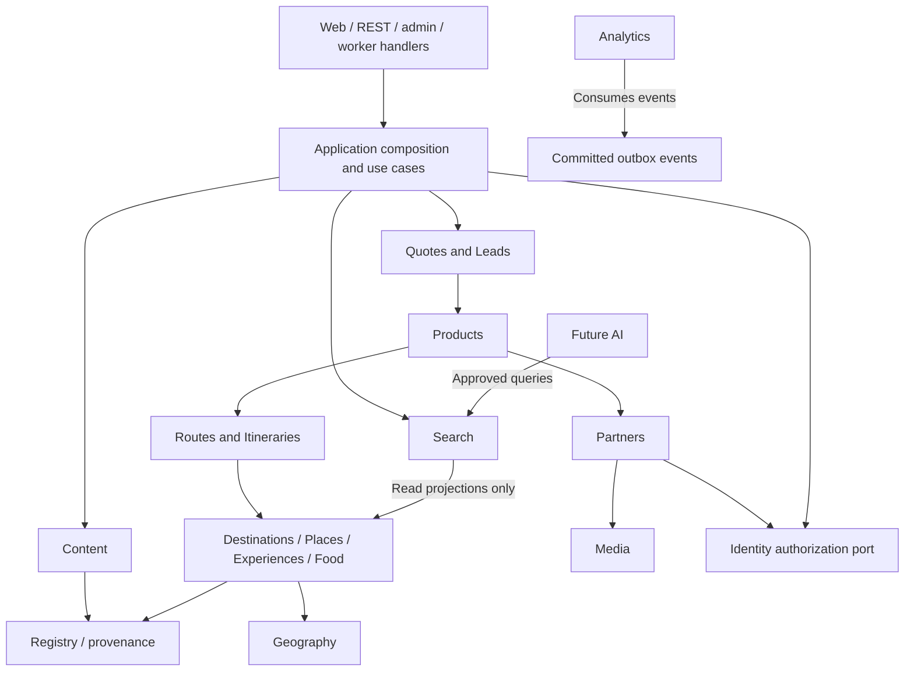

# Module boundaries and data ownership

Date: 2026-10-02. Status: recommended design; names below describe logical ownership; the canonical foundation is now implemented under ADR-0014.

Read with [system architecture](system-architecture.md) and [ADR index](../adr/README.md).

## Boundary rules

Each module exports application commands and immutable query projections through `public.ts`. Controllers, workers and admin screens call those interfaces. Only the owner writes its tables or interprets its business statuses. Prisma is an infrastructure adapter; a shared Prisma client is not permission for cross-module queries. Cross-module read composition uses public query ports; optimized shared read projections, if needed, get an explicit owner and are rebuildable.

Use stable IDs across boundaries and foreign keys in the application database. No cross-module cascade delete of canonical entities: deprecate/withdraw first and coordinate lifecycle through owning services. Transactions are coordinated by an application use case using exported commands with a platform transaction context; there are no nested independent commits when invariants need atomicity. External calls never occur inside long-lived DB transactions. Changes to source data, audit and outbox commit together.

Avoid circular service dependencies. Leaf domains expose query ports; higher-level planners/marketplace/composition services depend on them. Graph registration is a narrow platform contract, not an orchestrator importing all domain modules. Application-domain code does not depend on Search, Analytics or AI; those consume public projections/events.

## Ownership matrix

| Module                       | Owns / illustrative tables                                                                                      | Allowed synchronous dependencies                                      | Important boundary / first release                                                                                                                                         |
| ---------------------------- | --------------------------------------------------------------------------------------------------------------- | --------------------------------------------------------------------- | -------------------------------------------------------------------------------------------------------------------------------------------------------------------------- |
| Identity / Users             | `user`, `credential` or external identity, `session`, `role`, `permission`, role bindings, `partner_membership` | Platform security/audit                                               | Membership links partner ID through FK; partner lifecycle coordinates provisioning. Never infer access from commercial tier. Foundation/private flows                      |
| Geography                    | `geo_entity`, geometry, containment and alternate names                                                         | Registry/provenance platform                                          | Administrative and tourism groupings are explicit; cycle prevention and coordinate validity. MVP                                                                           |
| Destinations                 | `destination`, discovery profile, localized slug, geography links                                               | Geography, Registry/provenance                                        | First-class entity referencing geography; not CMS copy or administrative geography itself. MVP                                                                             |
| Places                       | `place`, categories, sourced hours/access/location facts                                                        | Geography, Destinations, Registry/provenance                          | Physical POIs including restaurant/hotel/venue; no supplier accounts or prices. MVP                                                                                        |
| Experiences                  | `experience`, concept classification, season/difficulty facts                                                   | Geography, Destinations, Registry/provenance                          | Seller-independent concept; commercial offers belong to Products. MVP                                                                                                      |
| Food                         | `dish`, cuisine concepts, sourced associations                                                                  | Places, Destinations, Registry/provenance                             | Restaurants are Places; Food links dishes/cuisines rather than duplicating restaurant identity. MVP                                                                        |
| Routes                       | `route`, `route_mode`, `route_stop`, sourced time/access facts                                                  | Geography, Destinations, Places, Registry/provenance                  | Approved corridors/stops, not invented routing-engine output. MVP                                                                                                          |
| Itineraries                  | `itinerary`, `itinerary_day`, `itinerary_stop`, visibility/revisions                                            | Routes, Places, Experiences, Destinations, Registry/provenance        | Curated plans first; saved/generated private plans later; product itinerary is an offer snapshot owned by Products. MVP/later                                              |
| Events                       | `event`, schedule/timezone, venue/organizer references                                                          | Places, Destinations, Partners public query, Registry/provenance      | Independent entity, not just an article; venue is a Place and organizer may be a Partner. Release 3                                                                        |
| Partners                     | `partner`, `partner_location`, verification cases/decisions, entitlement records                                | Geography, Destinations, Media, Identity authorization port, Registry | Organization and trust; Identity owns login/memberships. Claim/review operations coordinate through application orchestration. Directory MVP; portal Release 2             |
| Travel Products (`products`) | `travel_product`, `product_destination`, `product_day`, `product_day_stop`, moderation/pricing/policies         | Partners, Destinations, Places, Experiences, Routes, Media, Registry  | Supplier offer; copies published offer itinerary facts with provenance, does not mutate curated plans. MVP                                                                 |
| Leads                        | `traveler_request`, consent, `lead_match`, lead lifecycle/match snapshots                                       | Identity, Partners, Products, Geography/Destinations                  | Private request and authorized distribution; never public knowledge graph. Release 2                                                                                       |
| Quotes                       | `quote`, `quote_revision`, `quote_item`, decision records                                                       | Leads, Partners, Identity                                             | Immutable sent revisions; no payment/booking side effects. Leads does not synchronously depend on Quotes; application coordinator handles decision consequences. Release 2 |
| Content                      | `content_item`, approved editorial snapshots, external revisions/entity links                                   | Registry public resolver, Media, Content command/query port           | Content owns editorial drafts/revisions and public snapshots; custom CMS is presentation. MVP                                                                              |
| Search                       | Projection checkpoints/index schema, query policy                                                               | Public query ports of indexed owners                                  | No canonical writes or private indexing. MVP                                                                                                                               |
| Media                        | `media_asset`, `media_derivative`, rights, classification, processing state                                     | Storage/scanner ports, Identity authorization                         | Callers specify classification and purpose; Media enforces authorized access. MVP                                                                                          |
| Analytics                    | Event schemas, dedupe/aggregate records                                                                         | Consent/Identity policy, event stream                                 | No synchronous business decision depends on external analytics delivery. MVP                                                                                               |
| AI (future)                  | Generation provenance, user-visible draft plans and evaluation records                                          | Approved Search, Routes, Itineraries, Products and knowledge queries  | Read-only tools initially; no direct SQL, publication or autonomous lead sends. Release 4                                                                                  |
| Admin surface                | No duplicate domain tables                                                                                      | Owning application commands                                           | Moderation UI/orchestration; permission does not imply arbitrary DB write access. MVP                                                                                      |
| Platform support             | Registry/provenance, `audit_log`, `outbox_event`, inbox/dedupe, delivery records, config                        | Infrastructure ports only                                             | Mechanisms, not a catch-all business domain; limited exports. Foundation                                                                                                   |

The table expands the existing schema outline with missing logical responsibilities such as destination profiles and quote revisions. Actual field definitions/constraints require migrations and schema review during implementation; policy choices follow [implementation defaults](implementation-defaults.md). It is not an executable schema contract.

## Database ownership

- One application DB with module table conventions and a single ordered Prisma/SQL migration stream. Module reviews own their tables and migrations; platform owns migration execution and extension setup.
- Custom CMS calls authorized NestJS Content commands and has no direct SQL credentials or separate database. Content alone writes editorial tables; it does not own canonical travel entities. ADR-0012 supersedes the earlier separate Strapi DB.
- OpenSearch indexes and Redis caches are derived. PostgreSQL outbox/checkpoints allow retry/rebuild without treating Redis as canonical business storage.
- Object bytes live behind StorageService; Media metadata/access state is canonical application data. CMS uses Media references rather than managing an independent unrestricted public upload store.
- No graph database at launch: PostGIS, typed FKs, entity registry and validated relation table serve the documented needs.

## Registry and provenance contract

Platform owns a minimal registry keyed by canonical UUID with entity type/lifecycle. Each owning module registers/unregisters through a narrow transactional port. Concrete domain entities reference their registry entry and owning ID. Registry entries have a unique type/ID mapping; owner deletion is blocked unless references and registry state are handled together. Relation endpoints are FK-backed; relation type rules constrain valid source/target types. Strong domain references (e.g. product partner) use typed FKs, not only graph edges.

`source_record` captures source identifier/URL/title/publisher/access date and source type. Domain fact records link provenance plus reviewer/verified/review-due timestamps. Sources do not prove a fact is currently correct; strict freshness rules apply to route time/access, visa, hours, prices and events. Editorial snapshots reference canonical facts/entities; contradictory prose is a publication-quality failure.

## Dependency direction

This diagram groups modules for readability; the ownership matrix specifies exact calls. Domain events are past-tense facts and cannot bypass command authorization. Dependencies are enforced with import checks and architecture tests; introduce a composition coordinator instead of creating bidirectional module imports.

## Cross-module workflows

### Public entity publication

1. Owner validates entity facts, required sources, status and revision; transaction writes entity, audit and outbox.
2. Content approves an editorial revision through authorized commands and validates references; a composition policy checks entity and editorial readiness. Canonical-only useful pages may publish without a mandatory article, according to their page-family quality gate.
3. Worker reads owning public projections and updates index, sitemap/public URL projection and caches idempotently. The source revision is attached to every delivery.
4. Failed consumers retry with backoff; scheduled reconciliation detects gaps. Source reads remain authoritative. Urgent withdrawal blocks public eligibility before asynchronous cleanup.

### Partner suspension

Partner command commits suspension, audit and outbox. Product public resolver checks current partner eligibility immediately. Worker removes related products/profile projections from caches/search and alerts moderation on failures. Existing requests and quotes retain restricted historical snapshots; new responses and acceptance are blocked while the supplier is suspended; existing sent quotes remain visible as unavailable historical records.

### Lead and quote

Leads transaction stores request and consent. Matching application service reads eligible partner/product projections, stores per-partner matches and reasons, then emits delivery work. Quotes queries the Leads access port before any send/read by a supplier; Identity checks live membership. Traveler decisions use Quotes commands and a coordinator updates Lead outcomes atomically with the one-accepted-quote-per-request policy. A notification worker uses minimum necessary delivery data; analytics receives a redacted event.

## Contracts and event safety

Event envelope: event UUID, type/version, aggregate type/ID/revision, occurrence timestamp and safe payload. For private workflows payloads contain IDs; authorized consumers fetch restricted records, rather than broadcasting contacts. Consumers persist dedupe/checkpoints and tolerate reordered deliveries. Terminal withdrawal revisions cannot be overridden by older publish events. Side effects with external providers use idempotency keys when supported and reconciliation where delivery outcomes are uncertain.

Interfaces include public projection queries, entity publication commands, partner eligibility, lead access, content revision import, media authorization and provider ports. Keep TypeScript wire contracts framework-free; validation is required at process boundaries. Do not share ORM entities with UI or integrations.

## Testing requirements

Unit tests cover relation rules, provenance/freshness, partner verification/tier independence, publication eligibility, quote arithmetic and transition rules in implementation defaults. Real PostgreSQL/PostGIS tests cover constraints, geometry, transactional audit/outbox, concurrency and migrations. Contract tests cover CMS revision replay, public DTO redaction and generated client compatibility. Integration tests exercise queue outage, index rebuild, invalidation loss and object classification. Authorization tests attempt cross-partner/traveler access, revoked memberships and suspended suppliers. Architecture checks forbid cross-module repository imports and frontend backend/ORM imports. End-to-end HTML and publication tests verify that approved facts, metadata and search visibility agree.

## Extraction policy

Keep synchronous domain calls in process until evidence supports extraction. First separate resource-heavy infrastructure or worker pools; this does not require splitting domain ownership. Search/media processing are plausible future service candidates, not committed extractions. An extraction ADR must identify owner, measured trigger, API/event contracts, data migration, FK replacement, consistency, failure handling, observability and rollback. Shared database writes by independently deployed services are not an acceptable completed extraction.

## Canonical foundation implementation

`libs/domain/src/knowledge-graph.ts` exposes framework-free draft commands/query ports and relation rules. `libs/database/src/knowledge-graph.repository.ts` owns Prisma/PostGIS adaptation and transaction context. GeoEntity, Place, Experience and ContentItem share registry lifecycle/identity; the registry enforces a typed owner at commit. Provenance is SourceRecord plus EntitySource. All other module tables remain future scope, including destination discovery profiles, partners and products. No API endpoints or CMS authoring flows were added. See [ADR-0014](../adr/0014-canonical-graph-storage.md).

## Implemented editorial CMS boundary

The custom CMS replaces the initial Strapi container choice under [ADR-0015](../adr/0015-editorial-cms-workflow.md). `apps/cms` is the authenticated Next.js staff interface and same-origin BFF. NestJS owns staff sessions, editorial revisions, provenance joins, media authorization and presentation commands. `libs/domain/src/editorial.ts` contains framework-free workflow and input contracts; `libs/database` implements transactional persistence. Public `apps/web` consumes published content and validated presentation projections. See [CMS development](../development/editorial-cms.md).

CMS content references canonical registry UUIDs; it cannot edit geographic coordinates, hierarchy, entity identity or commercial data. Editorial facts do not replace canonical records. A published revision remains immutable while a new draft is edited. Staff writes require RBAC, expected versions, audit records and an atomic outbox event. No outbox delivery worker or marketplace module is introduced.

## Implemented destination vertical

DestinationProfile references a DESTINATION or CITY GeoEntity UUID and owns sourced discovery interest/season facets. Geography retains identity, hierarchy, coordinates and canonical publication. The public Destinations reader composes canonical fields, eligible graph relations and published Content queries in a repeatable-read transaction. [ADR-0016](../adr/0016-destination-discovery-profiles.md) and [destination development](../development/destinations.md) define the contract. No partner/product/route/itinerary owner tables are introduced; structured collections remain empty and editorial guides are separate.

## Implemented attraction and experience discovery

Discovery composes read-only Places, Experiences, Destinations and Content queries in the modular monolith; it does not take write ownership from the canonical modules. Rich optional Place facts and independent Experience concepts remain in PostgreSQL, with PostGIS point authority. Content owns ATTRACTION_EDITORIAL/EXPERIENCE_EDITORIAL presentation referencing canonical UUIDs. Eligibility and source checks apply independently to owners, edges and snapshots. Public destination links and discovery filters derive from approved knowledge graph paths. See [ADR-0018](../adr/0018-attraction-experience-discovery.md) and [discovery development](../development/discovery.md).

## Sprint 3 unified search

[ADR-0019](../adr/0019-derived-unified-search.md) and [search development/contracts](../development/search.md) define the implemented OpenSearch aliases, durable PostgreSQL change marker/manifests, current eligibility filtering, grouped `/api/v1/search`, autocomplete and SSR/noindex search page. PostgreSQL remains canonical; commercial/future families are not indexed.
