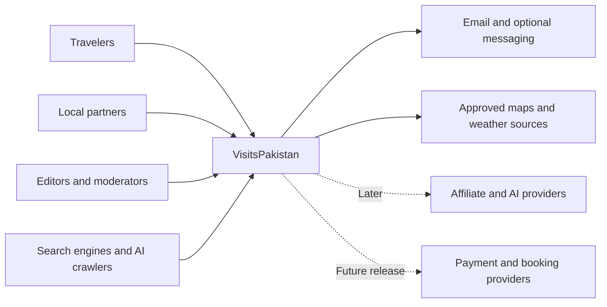
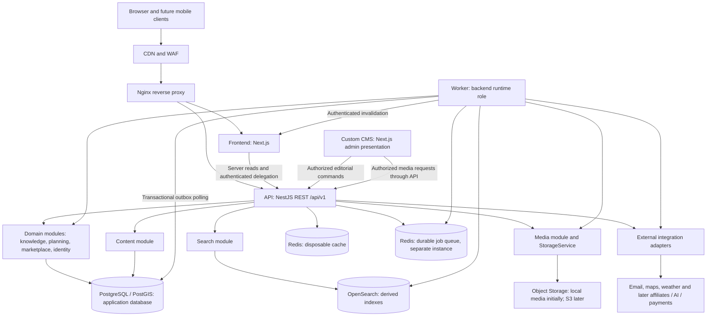

# VisitsPakistan implementation architecture

Date: 2026-10-02. Status: recommended implementation baseline; Sprint 0 foundation implemented; remaining domain architecture is target design.

## Evidence and precedence

Reviewed `AGENTS.md`, every existing Markdown document under `docs`, all three workbook data sets and the conceptual architecture PNG. That initial review found no application source. Sprint 0 now adds pnpm/Nx apps/libraries, platform endpoints, Prisma baseline and development infrastructure; [ADR-0012](../adr/0012-sprint-0-platform.md) supersedes the Strapi runtime and prior package layout. Tourism/editorial workflows remain unimplemented. Existing uncommitted documentation and the deleted root README are preserved.

Next.js is confirmed by the project owner and is the sole frontend direction. Earlier Vite references have been updated; [ADR-0002](../adr/0002-frontend-rendering.md) records the resolved decision. PostgreSQL/PostGIS is confirmed as initial canonical SQL storage. This covers structured entities, marketplace data, sessions and media metadata; image/video/document bytes use the existing protected local provider initially, with S3-compatible storage as the later target under [ADR-0005](../adr/0005-media-storage.md). RBAC governs permissions, combined with resource ownership; authentication is verified login and revocable sessions. The owner delegated remaining policy choices to engineering; concrete defaults are in [implementation defaults](implementation-defaults.md) and [ADR-0011](../adr/0011-implementation-policy-defaults.md).
The written standalone Linux deployment remains the launch recommendation. Cloud hosting means a portable Linux VM initially, not an assumption of a managed application platform. The PNG is conceptual, not evidence that Kubernetes, bookings, integrations or microservices exist.

Source documents:

- [Product vision](../01-product/product-vision.md), [release plan](../01-product/releases.md), and [existing architecture](../02-architecture/architecture.md).
- [Knowledge graph](../03-data/knowledge-graph.md), [schema outline](../03-data/data-schema.md), and [API contracts](../04-api/api-contracts.md).
- [Screens](../05-ux/screen-inventory.md), [flows](../05-ux/user-flows.md), and [SEO requirements](../06-seo/seo-architecture.md).
- [Partner model](../07-marketplace/partner-model.md), [quote workflow](../07-marketplace/quote-workflow.md), and [infrastructure](../08-infrastructure/infrastructure.md).
- [Master backlog](../01-product/master-backlog.xlsx): 152 stories; 92 labelled MVP. The narrative release plan governs delivery sequencing; differing spreadsheet labels do not move AI, bookings or portal features into launch.
- [Authoritative SEO opportunities](../06-seo/500_Page_Content_SEO_Master.xlsx): 500 rows but 285 distinct proposed URL strings, with 145 repeated URL groups. The older `seo-content-master.xlsx` has identical opportunity rows. Use the named master for remaining opportunities, consolidate each repeated URL group into one useful page, and retain all relevant row intents; row count is not a publication target.

## 1. System context

VisitsPakistan is a travel knowledge and discovery platform with a local supplier marketplace. Travelers discover approved travel information, research routes and experiences, compare partner products and contact suppliers. Editors maintain sourced information; moderators approve entities, suppliers and products; partners manage their own listings and, later, respond to requests. Search engines and AI crawlers consume the same published HTML as visitors. Future mobile clients use the versioned API.

The platform owns travel entities, relationships, provenance, marketplace eligibility and traveler requests. External providers supply delivery, maps/weather, affiliate services and eventually AI/payment capabilities through explicit adapters. No provider becomes the source of canonical partner verification or publication status. A WhatsApp click is a clickout, not proof of a delivered message or booking.



## 2. Container architecture and dependency diagram

Begin with a **NestJS modular monolith**, plus a separate web/CMS presentation and infrastructure processes. A separate worker uses the same backend modules and release image; it is a runtime role, not a domain microservice. PostgreSQL transactions and in-process interfaces keep launch operations manageable. The expected first release is hundreds of quality pages and dozens of founding partners, not demonstrated independent service workloads. High public traffic is primarily addressed through static generation, cache and CDN.

Microservices now would add network failures, distributed transactions, independent schema evolution, deployment coordination and substantially more monitoring without a validated scaling need. Extraction requires measured resource contention, independent ownership or release cadence, an availability/isolation requirement and operational capacity. National reach alone is not an extraction criterion. See [ADR-0001](../adr/0001-modular-monolith.md).



Arrows mean calls or data dependencies, not unrestricted network access. Custom CMS presentation has no database credentials; CMS media requests pass through authorized API commands. Worker indexing obtains public projections through module interfaces. The frontend never connects directly to databases, OpenSearch or CMS. See [deployment architecture](deployment-architecture.md) for trust zones.

| Container                | Responsibility                                                                    | Failure behavior                                                                                                                  |
| ------------------------ | --------------------------------------------------------------------------------- | --------------------------------------------------------------------------------------------------------------------------------- |
| Next.js                  | Public HTML, metadata, accessible interaction, partner/admin UI                   | Cached approved public HTML can survive an API outage within freshness limits; private flows fail explicitly                      |
| NestJS API               | Validation, authorization, use cases, public composition                          | Canonical writes require PostgreSQL; optional dependencies cannot block unrelated reads                                           |
| Worker                   | Outbox delivery, indexing, invalidation, media processing and later notifications | Durable work resumes after restart; no request waits for indexing                                                                 |
| Custom CMS               | Next.js admin presentation over Content commands                                  | Public reads use approved Content snapshots; UI outage affects editing only                                                       |
| PostgreSQL/PostGIS       | Canonical entities, transactions, provenance, operational records                 | Backup and restore mandatory; database outage blocks writes                                                                       |
| OpenSearch               | Public search and geo/filter projections                                          | Search reports temporarily unavailable or uses a bounded approved directory fallback; never silently returns an unbounded DB scan |
| Redis cache / queue      | Separate eviction and durability policies                                         | Cache outage falls back to DB with concurrency limits; queue work remains recoverable from durable outbox                         |
| StorageService providers | Public derivatives and private documents                                          | Missing public media has a fallback; verification document access fails closed                                                    |

## 3. Module architecture

Domain code contains business rules and typed entities; application services orchestrate use cases; ports describe repositories/providers; infrastructure adapters implement Prisma, PostGIS, Redis and external integrations. NestJS controllers/jobs translate transport input and invoke application services. Domain code does not import NestJS, Prisma or provider SDKs.

Published module contracts are explicit interfaces/DTOs and versioned event payloads. No module accesses another module's repositories, Prisma models or mutable entities. Read composition uses exported query interfaces; writes use owning commands. Dependency rules and ownership are detailed in [module boundaries](module-boundaries.md). Admin is an orchestration surface, not a second owner of domain data. AI, booking and events can be designed without scaffolding unused modules.

## 4. Proposed repository structure

Sprint 0 uses the requested pnpm/Nx workspace and single lockfile; versions and task targets are now pinned. This layout combines current foundations with later domain/infra directories, which are not all implemented. Prisma schema/migrations live in `libs/database/prisma`, rather than the earlier `apps/api/prisma` proposal.

```text
apps/
  web/                         # Next.js public, partner and admin route groups
    src/app/                   # rendering, metadata and UI composition
    src/features/              # UI grouped by capability
    src/lib/api/               # generated public client and server API adapter
  api/
    src/bootstrap/             # API and worker entry points; same image
    src/modules/<module>/
      domain/
      application/
      ports/
      infrastructure/
      presentation/            # REST controllers and job handlers
      public.ts                # allowed module exports
    src/platform/              # auth guards, transactions, outbox, config, logging
  cms/                         # Next.js custom admin presentation
libs/
  domain/                      # framework-free public contracts
  database/                    # Prisma/PostGIS adapters and migrations
  search/                      # OpenSearch adapter
  cache/                       # Redis adapter
  auth/                        # permission contracts; auth flows later
  config/                      # validated environment configuration
  ui/                          # shared presentational components
  analytics/                   # event contract; no tracking enabled
  testing/                     # test helpers and integration target
infra/
  compose/                     # environment-specific composition
  nginx/
  scripts/                     # deploy, migrate, backup, restore
tests/
  integration/                 # real dependencies and module contracts
  e2e/                         # rendered HTML, ownership, marketplace flows
docs/
  02-architecture/
  adr/
HANDOFF.md
```

Keep unit tests beside owning code. Content migrations join the centrally ordered application migration history. Frontend imports API contracts, never backend domain/infrastructure. Strict TypeScript, schema validation and dependency checks are baseline gates.

## 5. Domain boundaries

Knowledge domains: Geography, Destinations, Places, Experiences and Food. Planning domains: Routes, Itineraries and later Events. Marketplace domains: Partners, Travel Products, Leads and Quotes. Supporting modules: Identity/Users, Content, Search, Media, Analytics and operational Audit/Jobs/Integrations. AI is a future orchestration domain over approved query interfaces. Taxonomy starts within its owning domain; a shared taxonomy service is not required.

An experience is a seller-independent activity concept; a product is a supplier offer; a place is a physical location; a partner is a commercial organization, possibly operating at that place. A hotel can be both a Place and a Partner linked by identifiers without duplicating their responsibilities. A destination is a discovery profile referencing geography, not an additional administrative level. Geography must support administrative and tourism groupings without assuming a single universal Country → Region → Province hierarchy.

## 6. Database ownership and consistency

Use one application PostgreSQL database with PostGIS, no separate CMS database, and one physical cluster initially if capacity allows. Content owns editorial tables independently of canonical modules. Application table ownership follows modules, with one centrally ordered migration history. Foreign keys enforce stable cross-module IDs inside the monolith; cross-module writes still go through owning services. Extraction requires replacing cross-database foreign keys and designing replication explicitly, not prematurely removing integrity now.

The application owns stable IDs, localized slug records, publication state, facts, provenance, geometry, relationships and marketplace data. Use UUID identifiers; unique slugs per entity family/locale; UTC instants plus IANA local timezone for schedules; decimal money with currency and explicit quote/price semantics. Unknown values remain unknown, not zero or invented defaults. Store coordinates in a documented WGS84 representation; geography distance calculations and GiST indexes need parameterized SQL and migration tests. Do not convert PostGIS queries into JavaScript full-table filtering.

Avoid unchecked polymorphic graph edges: use a small `entity_registry` of stable entity IDs/types, owned by the graph support boundary, with relation endpoints referencing it. Owners register entities in the same transaction; relation commands validate endpoint types and relation rules. Concrete tables retain typed relationships for critical invariants. Registry deletion is coordinated and blocked by active references; operational PII entities never enter the public graph. The generic edges in the source schema are a logical outline, not permission to omit referential validation. See ADR-0003.

Facts needing verification link source records, reviewer, verified timestamp and review due date. Document fact-level provenance rather than only a page-wide timestamp. Administrative mutations and audit records commit together. A business transaction also writes a PostgreSQL outbox row; a worker retries derived search/cache/notification updates. Delivery is at least once; handlers deduplicate event IDs and compare aggregate revisions. Redis never becomes the only record that a committed change needs processing. See ADR-0004.

## 7. CMS boundaries and publication

The custom CMS in `apps/cms` is a Next.js admin presentation over authorized NestJS Content commands. Content owns editorial composition, localized revisions, review and approved public snapshots in application PostgreSQL; canonical travel facts/entities remain owned by their domain modules. No separate CMS backend/database or Strapi adapter is deployed. Sprint 0 implements only the inert shell, without data, authentication or editorial actions.

Future publication validates permission, sources, entity references and rich-content sanitization, then records the approved revision/public snapshot, audit and outbox atomically. A publication command does not bypass canonical eligibility or quality gates. Public composition uses approved snapshots; draft previews require authorized short-lived access and no-store. Withdrawals update public eligibility before idempotent search/cache/sitemap cleanup. Media uses the API Media boundary, not a separate unrestricted upload store. See ADR-0012 for the superseding CMS decision.

## 8. API architecture

NestJS is the sole business API under `/api/v1`, preserving the existing resource contracts. Public list/detail/search endpoints expose allowlisted published DTOs. Partner/traveler/admin namespaces invoke the same domain services with authorization. Next.js may provide a thin same-origin delegation layer and HTML composition, but does not become a second business backend. Mobile clients later consume the same REST contracts with an appropriate client authentication flow.

OpenAPI is generated and checked for compatibility; clients derive from it, not Prisma. Validate body, path and query schemas; cap page size, text length, search complexity and geographic radius. Use cursor pagination for mutable large lists and deterministic tie breakers. Existing page-number contracts can be retained for small stable directories. Use UTC ISO timestamps, locale, currency and explicit units. Return standard HTTP status and a consistent problem response with stable error code and request ID; no stack traces. Define deprecation windows before introducing v2.

Mutations for requests, sent quotes and administrative decisions support scoped idempotency keys: actor + operation + key + payload hash with a durable result; reuse with a changed payload conflicts. Use optimistic revision checks for edits and unique constraints for races. Service timeouts, body limits, integration retries and upload limits are enforced. Sensitive routes are `private, no-store`. API authorization applies even for server-rendered calls; forwarded identity is validated, never accepted from an arbitrary header.

## 9. Search architecture

OpenSearch owns derived public projections, not canonical data. Start with a unified versioned public entity index containing ID/type, locale, canonical URL, names/aliases, excerpt, taxonomy, destination ancestry, approved geo point, publication revision and freshness. Keep separate type-specific fields where needed. Never index contacts from traveler requests, verification documents, draft CMS text or private quote information.

Outbox consumers build documents from owning public projections. Writes carry source revisions so old retries cannot resurrect an unpublished item. Withdrawals produce versioned tombstones. Query results recheck canonical publication eligibility in a batched public resolver; tolerate fewer results when stale entries are filtered, and paginate consistently. Authorization revocations are not delegated to index freshness.

Use explicit mappings, bounded facets and geo queries, curated synonyms and language-aware analyzers validated with English/Urdu fixtures before multilingual launch. Relevance starts with transparent lexical signals and geography; business tier is excluded. Sponsored blocks are separate labelled results with separate reporting. Rebuild a new index from a consistent high-water mark, catch up concurrent outbox updates, verify counts and sampled eligibility, then atomically switch the read alias. Record schema versions and indexing lag; reindex is a runbook operation. Vector search is deferred.

## 10. Caching architecture

Cache only approved public projections. Layers are browser/CDN immutable assets, public HTML cache, explicit Next.js data/render cache and Redis public API/query cache. Configure each deliberately; do not rely on framework defaults. Keys include environment, schema version, locale, entity revision or query filters; private identity never shares a public key. API ETags and normalized query keys reduce unnecessary work.

Entity/content publish events invalidate dependent detail pages, directory projections, relation pages, sitemap records and search query caches. Maintain a bounded dependency map; TTL is the backstop for lost invalidations. Use jitter and single-flight regeneration to limit stampedes. Draft previews, authenticated dashboards, requests, quotes and verification responses are `no-store` at every layer; do not cache responses with session cookies at the edge.

Initial cache tuning defaults: approved evergreen content up to 15 minutes, general directories up to 5 minutes, frequently changing event/product projections up to 60 seconds. These are tuning hypotheses, not factual freshness guarantees or measured SLAs. Publication/eligibility checks and urgent purge override stale serving. Source review freshness is independent of cache TTL: an expired fact is marked unavailable/review-needed. Failed origin revalidation can serve evergreen public data only within an explicit stale budget; dynamic price/access warnings must remain qualified.

Redis cache can evict. Redis job queues must use a separate no-eviction instance with persistence and resource bounds. Sessions use durable PostgreSQL-backed records initially, so cache eviction cannot log everyone out. Cache failure should degrade performance, not change authorization. Distributed cache sharing and edge purge become release gates before adding web replicas. See ADR-0007.

## 11. Media architecture

Media owns object metadata, rights/licensing, attribution, alt text, derivative status, lifecycle and access classification. StorageService exposes provider-neutral put/read/delete/public-URL/private-access operations. Records store provider/key/checksum/MIME/size, never an absolute server path. S3-compatible storage is the later target; use protected local storage for development and initial production, with off-host backups. PostgreSQL stores media metadata, not file blobs. Do not deploy a second on-host object-storage cluster just to emulate cloud storage.

Upload authorization precedes quota enforcement and quarantine. Validate file signatures, allowed formats, dimensions and sizes; strip metadata, scan private documents, safely decode/re-encode images and generate responsive AVIF/WebP plus fallback derivatives. Disallow executable uploads and sanitize or prohibit SVG. No object is public until approved; unprocessed documents cannot be downloaded. Signed upload URLs are scoped, short-lived and finalized only after server validation.

Public derivatives use immutable versioned keys and CDN delivery. Private verification originals use a separate bucket/prefix/access policy, with per-request owner/reviewer authorization, short-lived signed access or API streaming and audit logging. Nginx never exposes the private local folder. Malware-processing outage holds files in quarantine. Deletion/replacement triggers dependent invalidations and an audited, retention-aware lifecycle. S3 migration preserves keys, checksums and versions and uses staged reads; retire local primary only after restore and rollback proof.

## 12. Authentication and authorization architecture

Identity owns users, credentials or external-subject mapping, sessions and partner memberships. For initial same-origin web use, recommend opaque revocable sessions backed by PostgreSQL, Secure/HttpOnly/SameSite cookies, CSRF protection and session rotation after login/privilege changes. Use maintained authentication libraries with Argon2id, email verification, throttled recovery and token hashing; an OIDC provider may implement the same identity port later. Initial authentication is application-owned verified email/password with maintained NestJS/Passport strategies and Argon2id hashing. Recovery tokens are hashed, single-use and short-lived; no external identity provider is required initially.

Authorize commands using role plus object relationship: traveler owns request; user belongs to the relevant partner with required permission; reviewer has explicit moderation scope. RBAC roles and permissions are PostgreSQL-backed; a partner ID in a request or JWT does not establish membership. Recheck suspension and current permissions at use time. Administrators and CMS staff require MFA; editors cannot grant verification or commercial entitlement. Custom CMS uses API authentication and scoped editorial permissions; the Sprint 0 shell exposes no privileged data/actions. Record actor/service identity and reason for privileged decisions. See ADR-0006.

## 13. Partner marketplace architecture

Partners owns organizations, membership-linked capabilities, coverage, claims, verification cases and decisions. Preserve documented verification statuses `UNCLAIMED`, `CLAIMED`, `VERIFICATION_PENDING`, `VERIFIED`, `SUSPENDED`. Rejection is a verification-case decision returning the partner to CLAIMED; corrected evidence permits a new audited application. Suspension stays until a reviewer reinstates trust; paid tier never affects this decision. Commercial tiers `FREE`, `PROFESSIONAL`, `PREMIUM` are separate entitlement records and never inputs to verification decisions.

Products owns offers, itinerary days/stops, inclusions, exclusions, price semantics, policies and moderation. Product publishing references eligible partners and valid entities through module ports. Partner suspension immediately affects public eligibility and triggers product/search/cache withdrawal; it cannot rely only on eventual indexing. Reinstatement restores eligibility but products need explicit moderator approval before republishing. Public product prices include currency, date/validity, basis and qualification; missing current prices are not estimated.

Organic results and lead matching never use commercial tier as a hidden rank boost. Sponsored placements are separately selected and visibly labelled. Entitlements may eventually limit usage only under a disclosed approved policy. Build directory/product inquiry first; defer billing, availability, payment and settlement. See ADR-0008.

## 14. Lead and quote architecture

Release 2 introduces Leads and Quotes. Leads owns traveler requests, consent, eligibility/matching snapshots and per-partner lead records; Quotes owns quote drafts, line items, revisions, send/view/decision events and validity. Notification delivery is a retryable integration concern, not a quote status inferred from an email response.

Request submission validates criteria and anti-spam controls, stores request + consent + idempotency result + outbox event atomically, then matching records eligible partners and the reasons/version used. Matching uses approved coverage, specialization, verification, language and performance signals. Initial defaults are up to three eligible partners per request, fit then fair rotation for ties, minimal contact disclosure after explicit traveler consent, and request expiry after 14 days; see implementation defaults. A unique request/partner match prevents duplicate distribution. Notification deduplicates deliveries and records provider IDs where available.

Quotes validate matched-partner access, current eligibility, currency, line-item totals, validity and version. Sending creates an immutable quote revision/snapshot; edits create another revision. Traveler decisions validate ownership and quote expiry/revision under a transaction. A request may have at most one accepted quote revision, enforced transactionally; other quotes become not selected. Changing the choice requires reopening through an audited workflow. Acceptance expresses traveler intent; it does not create a booking, reserve availability or charge money. Internal workflow events are durable; derived analytics is separate. No traveler contact/requirements enter public search, logs or third-party analytics. Retention, withdrawal and deletion follow the implementation defaults and must be exercised before live PII intake.

## 15. Analytics architecture

Analytics owns a documented event taxonomy, consent-aware ingestion and aggregate reporting. Include destination views, entity/product progression, partner/WhatsApp clickouts and the existing lead/quote events. Define `quote_submit` from UX explicitly: traveler request submission and partner quote sending are distinct events, not ambiguous shared conversions.

Browser events carry allowlisted entity/page IDs, acquisition fields stripped of arbitrary query text and a pseudonymous event ID; server events record durable marketplace outcomes. Deduplicate event IDs and document which source is authoritative. Do not claim perfect exactly-once external delivery. Do not send names, email, phone, free-form request text, private URLs or raw search text to GA4/other providers. Optional analytics is opt-in; operational events exclude PII. Retention follows implementation defaults. Store limited operational aggregates in PostgreSQL initially; introduce a warehouse only for measured reporting contention. Partner reports are scoped to their organization. Sponsored and organic conversions remain distinguishable; AI referral attribution is best effort.

## 16. Observability architecture

Structured JSON logs and trace/request IDs flow through Nginx, web, API, jobs and integration calls. Emit module/operation/outcome/latency and safe entity IDs, not payload dumps. Redact authentication, contacts, verification evidence and arbitrary queries. Audit is a separate durable append-only record, not a debug log. Restricted audit access and export/deletion follow implementation defaults.

Metrics cover public HTML/API p95 latency and errors; request rate; DB pool/query contention; PostGIS plans; search freshness and errors; worker age/retries/dead letters; Redis memory/eviction; media failures; host disk/RAM/CPU; backup age and restore results. Tracing samples common reads and prioritizes errors/slow operations. External uptime probes are outside the standalone failure domain.

Engineering targets to validate: 99.5% monthly public availability, cached HTML TTFB p95 below 500 ms in representative locations, origin public API reads p95 below 500 ms under agreed load, and derived index lag p95 below 60 seconds. These are engineering targets, not established service commitments. Mobile field Core Web Vitals targets are LCP ≤2.5 s, INP ≤200 ms, CLS ≤0.1 at p75. Define realistic geography/network test profiles, load and error budgets before release. Use Prometheus/Grafana-compatible metrics, rotated structured logs and an external uptime probe; begin with lightweight collectors rather than exhausting the host with an unneeded telemetry cluster.

## 17. Deployment architecture

Target Docker Compose on a Hetzner Ubuntu LTS VM, Nginx origin, CDN/WAF edge and private service networks. Run frontend, API, worker, custom CMS, application PostgreSQL, OpenSearch and separate Redis cache/queue runtime roles with bounded resources. Launch uses no Kubernetes. Treat the existing 8–16 vCPU/32–64 GB class as a load-test hypothesis; OpenSearch heap and image processing compete with DB memory. See [deployment architecture](deployment-architecture.md) and ADR-0009 for environments, CI/CD, recoverability and scaling gates.

## 18. Security architecture

Threat boundaries are public clients/edge, authenticated app users, editorial staff, integration webhooks, uploads and private data stores. Enforce TLS, origin restriction, private DB/search/cache ports, least-privilege service credentials and scoped Content commands. Secrets are injected from protected environment/secret mounts, validated at startup and rotated; never exposed through public frontend environment variables.

Defend object-level authorization, injection, CSRF, stored XSS, SSRF, credential stuffing, spam and file abuse. Parameterize SQL/search; sanitize CMS markup and safely serialize JSON-LD; set CSP and appropriate security headers; restrict image proxy and fetch hosts; webhook fetches use fixed provider endpoints. Rate limits exist at edge and application, with stricter limits for login, leads and upload. If the limiter is unavailable, sensitive writes fail closed or use a bounded conservative local control; public read fallback remains bounded. Trusted proxy configuration prevents forged client-IP bypass.

Encrypt backups and private storage; restrict review exports; patch images/dependencies and scan in CI. Audit privileged publication, verification, sponsorship, entitlement and data access decisions with reason and actor. Do not copy PII/document bodies into audit JSON; reference restricted evidence. Abuse review, incident response, secret rotation and urgent takedown runbooks are release gates. Use the documented minimization/retention defaults; deployment must validate applicable legal obligations rather than claim compliance from architecture alone.

## 19. SEO rendering architecture

Next.js rendering: statically generate/revalidate approved destinations, places, experiences, food, guides, curated routes/itineraries and directory landing pages; use server rendering for volatile published events/product projections where needed; authenticated areas are dynamic and uncached. Search and most filter combinations are noindex; only curated useful category pages are indexable. Public HTML must contain actual facts/copy, title, H1, canonical, structured data, breadcrumbs and internal links before JavaScript.

Build detail data, metadata and JSON-LD from the same approved projection/revision. Distinguish product details from destination marketplace landings; route URLs from origin/destination API endpoints. Maintain localized slug/redirect ownership in application data; use trailing slashes on public content paths and permanent redirects for alternate forms. English launches first; locale-aware records and rendering enable Urdu later, including RTL. Emit hreflang only for real equivalent published pages, not empty translations. Normalize parameters and duplicates; return genuine 404/410 and avoid soft-404 shells.

Sitemap index is generated from canonical approved URL records by family/locale, with truthful lastmod and exclusion of drafts, private pages and duplicates. Robots is not a privacy mechanism; staging additionally requires authentication. Preview is noindex/no-store. Schema types must match visible supported facts; omit invented ratings, offers and opening hours. Resize media, reserve dimensions, prioritize the hero and lazy-load maps/secondary interactions. GEO relies on sourced answer blocks, entity links and freshness, not separate fabricated AI pages. Add raw-HTML tests, mobile accessibility/performance budgets and publish/unpublish invalidation tests. Use the named SEO master and a canonical route registry before import; see [SEO opportunity inventory](../06-seo/opportunity-inventory.md).

## 20. Future AI integration architecture

Release 4 adds an AI orchestration module over read-only approved Search/Knowledge/Routes/Itineraries/Product ports; do not build model infrastructure at MVP. Deterministic retrieval supplies entity IDs, source records, revision and freshness. Revalidate permissions and facts in canonical stores before generation. The model returns a schema-validated plan whose referenced entities and claims are checked against retrieved facts. Missing route, travel time, price, partner, opening hours, availability, event or visa information is explicitly unavailable.

Treat retrieved prose and external content as data, not instructions. Isolate prompts, restrict tool permissions, prevent arbitrary network access and reject unknown IDs/unsupported claims. Draft generated itineraries are private/unpublished; user confirmation invokes ordinary authorized save/request commands. The model cannot publish, verify suppliers, send a lead or charge a traveler by itself. Remove PII before provider requests, set request/token/cost budgets, audit safe provenance and maintain grounding, freshness, prompt-injection and refusal evaluations. Provider selection, retention and vector retrieval require later ADRs. See ADR-0010.

## Confirmed decisions and implementation defaults

Next.js, initial PostgreSQL/PostGIS storage and RBAC are confirmed. Other choices use the defaults delegated to engineering rather than remaining business-rule blockers. [Implementation defaults](implementation-defaults.md) specifies account/session flows, scoped roles, verification, matching, quote decisions, retention, URL policy, release sequencing, source governance and operations. [ADR-0011](../adr/0011-implementation-policy-defaults.md) records why and how those defaults may be changed.

Provider credentials, a purchased host, staff assignments and evidence for recovery/performance targets are implementation inputs, not unresolved architectural choices. Do not fabricate licenses, jurisdictional compliance or benchmark results; validate those at the relevant release gate. Future payment/AI providers remain intentionally deferred with their features.

## Risks and mitigations

| Risk                                                     | Mitigation / evidence required                                                                  |
| -------------------------------------------------------- | ----------------------------------------------------------------------------------------------- |
| Old documents drift from confirmed decisions             | Next.js/PostgreSQL/RBAC baseline is reconciled; enforce ADR and docs consistency in review      |
| Standalone host outage or data loss                      | Off-host encrypted backups, tested restore, external probes; scale for agreed availability      |
| Search/DB/media contention                               | Bound heap/jobs/connections; load test with realistic data; move pressured infrastructure first |
| Stale publication or suspended supplier leaks            | Canonical eligibility checks, versioned consumers, urgent purge and reconciliation              |
| Graph endpoints or CMS facts diverge                     | Referential registry, fact provenance and approved snapshot publication                         |
| Lead PII exposed to unrelated partners/providers         | Object authorization tests, explicit consent/disclosure policy, redacted payloads               |
| Paid tier accidentally influences trust or rank          | Separate models, query restrictions and negative tests                                          |
| 500 opportunity rows become duplicate/thin pages         | Deduplicate 285 proposed URLs and require editorial quality gate                                |
| Future AI invents facts or performs unauthorized actions | Approved retrieval, claim validation, limited tools and evaluation gates                        |

## Recommended implementation order and test gates

1. **Prepare foundation implementation.** Use the confirmed baseline and policy defaults; pin supported compatible versions, assign operators and translate release gates into acceptance tests. Next.js/storage/release conflicts are resolved in this document set.
2. **Release 0 foundation.** Workspace, strict TS, web/API skeleton, API schemas, migrations, PostGIS, safe config, logs, auth boundary, CI and Compose. Test bootstrap, dependency import rules, validation, health/readiness, migrations, backup restore and deployment rollback. Establish lint/typecheck/unit/integration/build commands.
3. **Knowledge and editorial vertical slice.** Geography → Destinations → provenance/relations → Content/Media → one server-rendered page. Test FK/type integrity, PostGIS boundary/distance cases, draft isolation, CMS duplicate/out-of-order events, upload permissions and HTML metadata. This proves entity ownership before mass content entry.
4. **Authority MVP.** Places, Experiences/Food, approved Routes/curated Itineraries, Search, directories, sitemaps and analytics. Test canonical URLs, redirect/sitemap correctness, initial HTML, accessibility, geo relevance, stale indexing/invalidation, privacy and cache outages. Load-test representative corpus, not just empty services.
5. **Partner/product slice.** Directory, reviewed verification and offers/contact clickouts with ownership and audit tests. Prove paid-tier independence, suspension withdrawal, private document protection and product price semantics. Sequence admin onboarding ahead of public badge claims even if a portal comes later.
6. **Release 2 marketplace.** Portal, Leads, Quotes and notifications using the documented consent/matching defaults. Test concurrent submissions/decisions, idempotency, membership revocation, unmatched access denial, quote revisions/expiry, job crashes and provider retries.
7. **Growth then intelligence.** Events/maps/affiliates/sponsored slots, followed by saved trips and grounded AI when data quality supports them. Evaluate sponsored separation, source freshness and AI grounding before release. Booking/payment/settlement is a separate future architecture review.

For implementation changes, required gates are lint, type checking, unit tests, relevant real-dependency integration tests and production build. Sprint 0 now has executable gates; exact development/runtime outcomes are reported in the handoff. Later domain tests remain future acceptance requirements.

## Technical references

Provider-specific implementation details must be checked again when versions are pinned. Current primary references supporting the general mechanisms: [Next.js explicit caching](https://nextjs.org/docs/app/getting-started/caching), [Prisma unsupported database features and custom migrations](https://www.prisma.io/docs/orm/prisma-schema/data-model/unsupported-database-features), and [OpenSearch manage aliases](https://docs.opensearch.org/latest/api-reference/alias/aliases-api/). These references do not settle project business policies or prescribe launch scale.

## CMS implementation decision

[ADR-0015](../adr/0015-editorial-cms-workflow.md) records the implemented custom Next.js CMS, superseding the original Strapi recommendation. Editorial APIs and persistence run inside the NestJS modular monolith. PostgreSQL canonical entities remain authoritative; CMS revisions reference their UUIDs. Tabler provides the open-source admin styling, with allowlisted site themes/templates and separate public SSR renderers. Media uses persistent local storage for development and the initial single-server Hetzner deployment under AGENTS.md and ADR-0012. Off-host backups and restore verification are required before production use; S3-compatible storage remains a future option.
